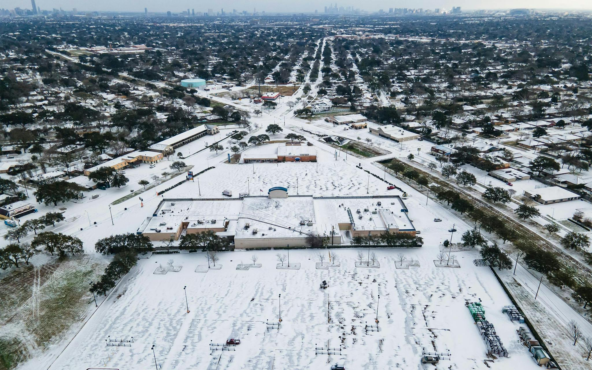

# Identifying the impacts of extreme weather on Houston's power grid during 2021 winter storms
*This repository was produced as a part of the UCSB MEDS program for EDS 223: Geospatial Analysis & Remote Sensing.*

## About
This repository contains a Quarto document `houston-blackouts.qmd` visualizing the impacts of extreme weather on Houston's power grid. This exercise involves:
- loading vector/raster data
- simple raster operations
- simple vector operations
- spatial joins



## Repository Structure
```
houston-blackout-mapping
│   README.md
|   houston-blackouts.qmd
|   .gitignore
│
└───data
    └───ACS_2019_5YR_TRACT_48_TEXAS.gdb
    └───VNP46A1
    │   gis_osm_buildings_a_free_1.gpkg
    │   gis_osm_roads_free_1.gpkg
└───images
    │   snow-storm-texas-2021-houston.jpg
```
## References/Acknowledgments
Data was provided as part of this [exercise](https://eds-223-geospatial.github.io/assignments/HW3.html), which was produced as a part of the Master of Environmental Data Science Program from the Bren School of Environmental Science and Management, taught by [Dr. Ruth Oliver](https://bren.ucsb.edu/people/ruth-oliver).